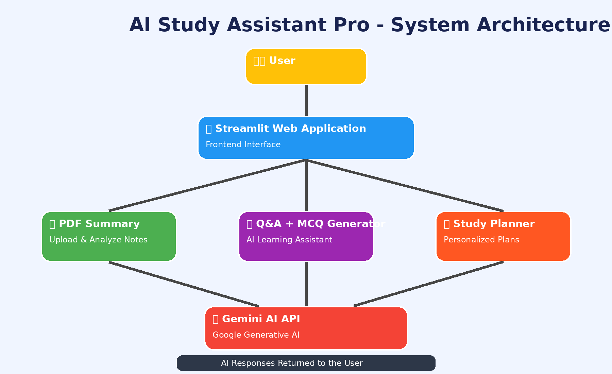
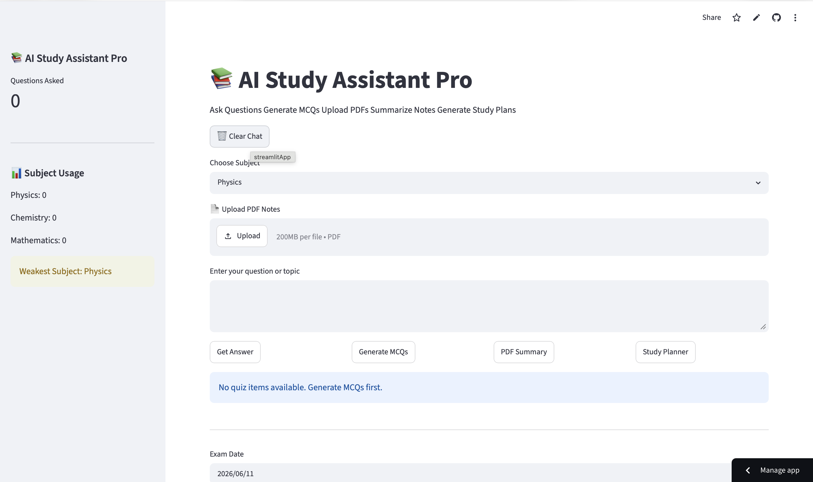
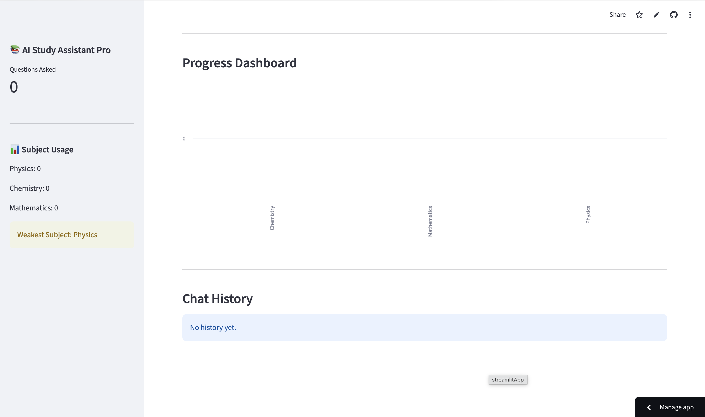
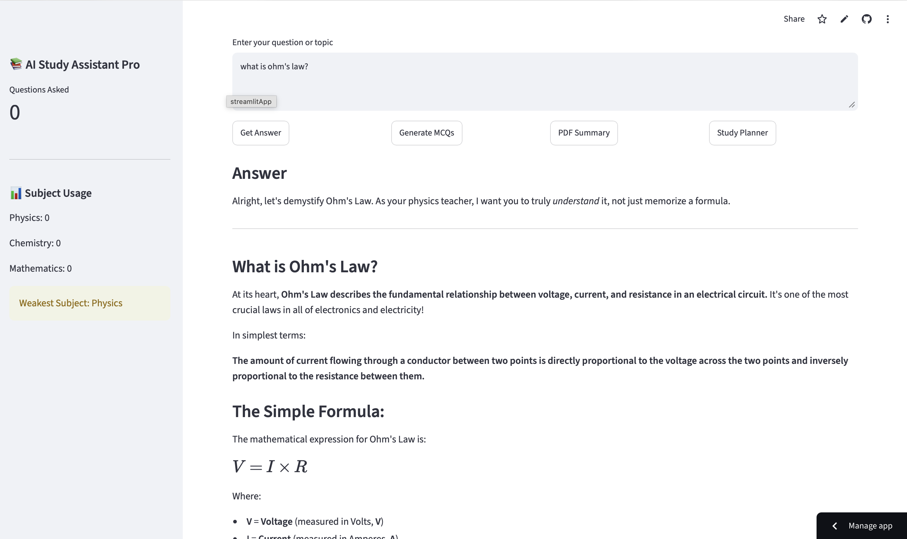

# AI Study Assistant Pro

An AI-powered study assistant built with Streamlit and Gemini AI.

## Features
- Answer Physics, Chemistry, and Mathematics questions
- Generate MCQs with automatic scoring
- Upload PDFs and summarize notes
- Generate study plans
- Track subject-wise progress
- View chat history

## Technologies Used
- Python
- Streamlit
- Gemini AI
- Pandas
- PyPDF

## Installation

pip install -r requirements.txt

streamlit run app.py

## Live Demo
https://ai-study-assistant-mvjna8bw5wxhmbetksejjz.streamlit.app

## Hackathon Submission

Track: Creative Apps

Deployment:
https://ai-study-assistant-mvjna8bw5wxhmbetksejjz.streamlit.app

## Architecture Diagram

## Screenshots

### Home Page

### Home Page 2

### Question Answering

